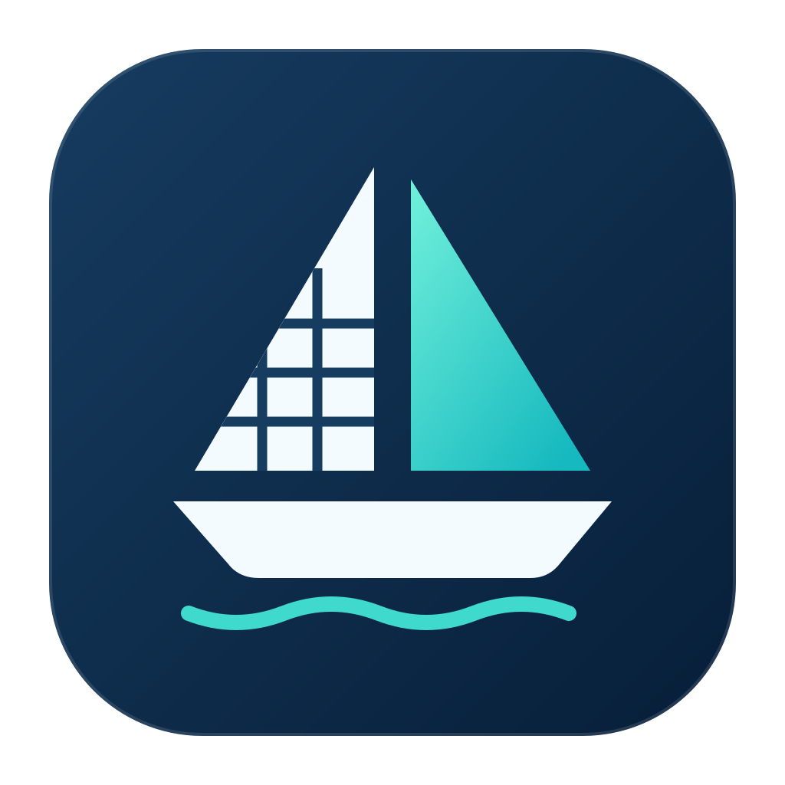

# YACHT — Yet Another CSV HTML Translator



**A TLO Labs open-source project.** YACHT converts CSV and TSV files into styled,
accessible HTML tables. One Rust core powers a command-line tool and native
macOS, Windows, and Linux interfaces. Thomas Lothian maintains the project.

The Rust/native rewrite replaces the former Tk application. Legacy implementations,
packaging and migration records are preserved on the [2.0.2 archive branch](https://github.com/tlolabs/yacht/tree/codex/archive-legacy-2.0.2).
Current Rust and native integration tests cover conversion behavior. See [feature parity](docs/FEATURE-PARITY.md)
and [verification evidence](docs/VERIFICATION.md) for test scope.

## Download and supported platforms

The repository builds six platform-specific targets. The [support matrix](docs/SUPPORT_MATRIX.md)
distinguishes personal testing from CI validation and records minimum OS versions.
Check the asset list and signing notes on [GitHub Releases](https://github.com/tlolabs/yacht/releases)
before downloading; availability can vary by release.

| Target | Minimum | Current package formats |
|---|---|---|
| macOS (ARM64/x64) | macOS 14.0 | Architecture-specific app ZIP; historical releases also have DMG |
| Windows (x64/ARM64) | Windows 10 1809 | Portable ZIP; historical releases also have per-user installer |
| Linux (x64/ARM64) | Ubuntu 24.04, glibc 2.39 | Current `.deb` or tar; AppImage is planned |

Use artifacts from a successful [Native cross-platform run](https://github.com/tlolabs/yacht/actions/workflows/native-macos.yml)
for clearly marked unsupported development builds. Nightly runnable packages are
intended only for macOS (ARM64); CI may still test other targets.

- **macOS:** extract the app ZIP and move YACHT to Applications. If a historical
  release has a DMG, open it and drag YACHT to Applications. Check that release's
  signature notes; development builds use ad-hoc signatures.
- **Windows:** extract the entire portable ZIP
  and run `YachtApp.exe`. Keep its DLLs together. The CLI is `yacht.exe`.
  Microsoft Edge WebView2 Runtime is required for table preview; install the
  [Microsoft runtime](https://developer.microsoft.com/microsoft-edge/webview2/)
  if it is absent. Historical per-user installers may be available.
- **Linux:** a current `.deb` installs the native
  dependencies and desktop entry. Launch YACHT or `yacht-gui`. For the tar archive,
  install Python/PyGObject, GTK, libadwaita and WebKitGTK as described in
  [BUILDING.md](docs/BUILDING.md), extract, and run `bin/yacht-gui`.

First launch shows the album sample. No account, upload, or paid service is needed.
Existing `~/.yacht_presets.json` presets are copied when the native preset store does
not yet exist. The original remains unchanged. Existing Mac presets/preferences
keep their original identity and location.

## Using YACHT

1. **Open CSV**, use your file manager's Open With, or drop a file into the window.
   Choose comma, tab, semicolon or pipe. A `.tsv` initially selects Tab. The first
   record supplies headers. **Sample** restores the built-in example.
2. Adjust font family/size, cell padding, border width/style/spacing/collapse,
   header/body/border/zebra/hover colors, zebra/hover toggles and table CSS classes.
   Text color fields accept safe CSS values; native color pickers supply hex colors.
3. Load **Default (Styled)** or **Unstyled**, or save a named preset. Load, replace
   and delete controls preserve the existing workflow, with destructive confirmations.
   Presets are portable JSON; copy `presets.json` between native stores while the
   apps are closed. There is no separate preset import/export dialog in the reference app.
4. Switch between **Table Preview** and read-only **HTML Source**. Preview renders
   the actual generated HTML/CSS. Copy HTML copies the complete document.
5. **Export HTML** opens the native Save dialog and its replacement confirmation.
   Reveal locates the saved output in the file manager; Browser opens it normally.

**Batch Convert** reviews selected inputs before writing `.html` beside each.
Existing output is left unchanged and reported unless you explicitly enable and
confirm replacement. Individual failures are listed and remaining inputs continue.
Multiple opened/dropped files also enter batch review. Cancel stops remaining work.

**Refresh** rereads the source with the current delimiter. Settings controls
remembered valid style, maximum preview rows, recent-file clearing and appearance.
Recent files retains ten successfully imported paths. The Mac uses native Settings
and menus; Windows/Linux expose the equivalent controls in their native windows.

### Input and output details

UTF-8 with optional BOM, Unicode/emoji, quoted delimiters, doubled quotes,
multiline cells, CR/LF/CRLF, blank fields and blank rows are supported. Missing cells
render blank; extra cells are preserved under `Column N` headers and reported.
Malformed quoting, NUL and invalid UTF-8 are errors. Save spreadsheet data as UTF-8
CSV when encoding errors occur. No raw HTML mode exists: all cell data is escaped.

Output is a full document with embedded CSS, semantic headers, and numeric right
alignment. Percentages remain left aligned. Exact Unstyled removes CSS/classes.
The HTML title is now `YACHT Table`; other deliberate historical corrections are
in [compatibility notes](docs/COMPATIBILITY.md).

Preview defaults to 200 rows and has a 2 MB bound; source is a UTF-8-safe excerpt
of at most 1 MB. Limits are shown visibly. **Copy and Export include every row.**
Work runs off the UI thread. Parsing retains the table in RAM; very large data and
full clipboard copies remain memory-limited. Cancellation before publication keeps
existing output intact. A completed export cannot be undone by later cancellation.

### Keyboard shortcuts

| Action | macOS | Windows / Linux |
|---|---|---|
| Open | Command+O | Ctrl+O |
| Export | Command+S | Ctrl+S |
| Copy complete HTML | Command+Shift+C | Ctrl+Shift+C |
| Batch convert | Command+Shift+B | Ctrl+Shift+B |
| Refresh | Command+R | Ctrl+R or F5 |
| Table preview / HTML source | Command+1 / 2 | Ctrl+1 / 2 |
| Settings | Command+, | Settings button |

Use native Tab/Shift+Tab navigation and screen-reader commands. Appearance follows
the system by default; export colors are independently chosen content. Native UI
controls support platform display scaling. Manual screen-reader/high-contrast and
scaling acceptance is tracked in the parity matrix.

## Command-line automation

Build with `cargo build --release --locked -p yacht-cli`, or use the packaged `yacht`:

```sh
yacht input.csv --output output.html --cell-padding 10 --border-style dashed
yacht one.csv two.csv three.csv
yacht input.tsv --delimiter tab --unstyled
yacht input.csv --overwrite
yacht --help
```

All existing style flags are retained. `--output` accepts one input only; otherwise
outputs are beside inputs. CLI delimiter defaults to comma regardless of filename.
Existing output requires `--overwrite`. Errors go to stderr, successes to stdout;
batch failures exit 1 and do not prevent later conversions. Ctrl+C cancels (130).
`--` permits filenames beginning with a dash; `--flag=value` is also supported.
The old `swift run yacht` development command is replaced by `cargo run -p yacht-cli --`.

## Permissions, updates and troubleshooting

Use local readable CSV/TSV files and a writable export directory. Batch export needs
write access beside each input. macOS may request file/folder access through native
panels. The app has no networking or notification permission requirement for
conversion. Preview blocks scripts and remote resources; Help/browser actions are
explicit user navigation.

Updates are manual downloads from GitHub; no automatic updater was present or is
introduced here. Keep a copy of your presets before upgrading development builds.
If presets cannot load, the app reports the error and leaves the file intact. Check
JSON types and style values against [file formats](docs/BEHAVIOR.md). If previews are
unavailable for large cells, export/copy remain complete. On Windows, a missing
WebView2 runtime affects the preview renderer; install it instead of disabling the
feature. Linux tar archives require the listed native packages.

## Development and project references

[Building](docs/BUILDING.md) · [Testing](docs/TESTING.md) · [Releasing](docs/RELEASING.md)
· [Architecture](docs/ARCHITECTURE.md) · [Canonical behavior](docs/BEHAVIOR.md)
· [Bindings/development](docs/DEVELOPMENT.md) · [Dependencies](docs/DEPENDENCIES.md)
· [Parity](docs/FEATURE-PARITY.md)

On a Mac with Xcode and Rust, `./script/build_and_run.sh` builds and launches
`dist/YACHT.app`; the Codex Run action uses the same entrypoint. All Rust business
logic is under `crates/`. All native frontends are grouped under `platform/macos`,
`platform/windows`, and `platform/linux`; macOS binding/UI tests live with that frontend.
Shared artwork is under `assets/icons`. Root `Package.swift` and `Yacht.xcodeproj`
remain build entry points. The GTK Python frontend is part of the current native
rewrite. Archived Python application data and generated HTML fixtures are absent
from the active tree.

## Project, privacy and licensing

YACHT supports a teaching workflow. It is shared for transparency and educational
use, as-is, without warranty or guaranteed support. Bug reports and pull requests
are welcome; response times may vary.

Thomas Lothian's original code and artwork are licensed GNU General Public License
v3.0 or later. See [LICENSE](LICENSE) and [license notice](LICENSE-NOTICE.md).
Third-party components retain their own terms. The [licensing audit](docs/LICENSE_AUDIT.md)
examines the Windows distribution separately. See [third-party notices](THIRD_PARTY_NOTICES.md) and
[dependencies](docs/DEPENDENCIES.md).

YACHT converts files locally and has no automatic updater. See [privacy](PRIVACY.md),
[security](SECURITY.md), [support](SUPPORT.md), [contributing](CONTRIBUTING.md),
[code signing policy](CODE_SIGNING_POLICY.md), and [changelog](CHANGELOG.md).
